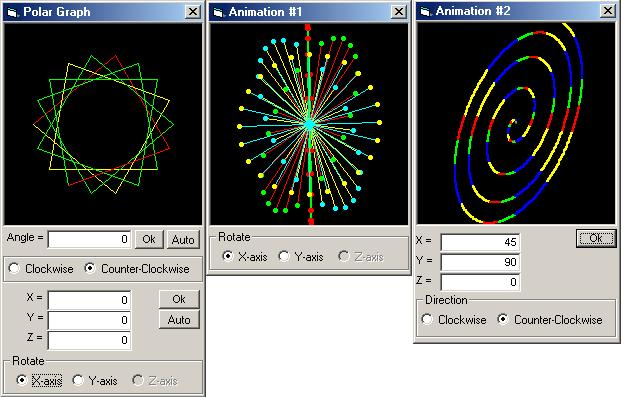



## Polar Graph \(Rotate and 3D View\)

### Description

Since many of you like my first polar graph, so here's a new one.

You can now rotate and view polar graph in 3D.
 
### More Info
 

             |
---                |---
**Submitted On**   |2003-11-27 01:14:22
**By**             |[Aries Buenaventura](https://github.com/Planet-Source-Code/PSCIndex/blob/master/ByAuthor/aries-buenaventura.md)
**Level**          |Advanced
**User Rating**    |5.0 (10 globes from 2 users)
**Compatibility**  |VB 6\.0
**Category**       |[Math/ Dates](https://github.com/Planet-Source-Code/PSCIndex/blob/master/ByCategory/math-dates__1-37.md)
**World**          |[Visual Basic](https://github.com/Planet-Source-Code/PSCIndex/blob/master/ByWorld/visual-basic.md)
**Archive File**   |[Polar\_Grap16768911272003\.zip](https://github.com/Planet-Source-Code/aries-buenaventura-polar-graph-rotate-and-3d-view__1-50151/archive/master.zip)

